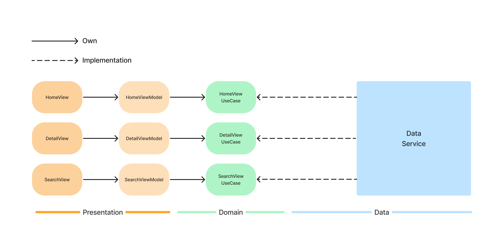
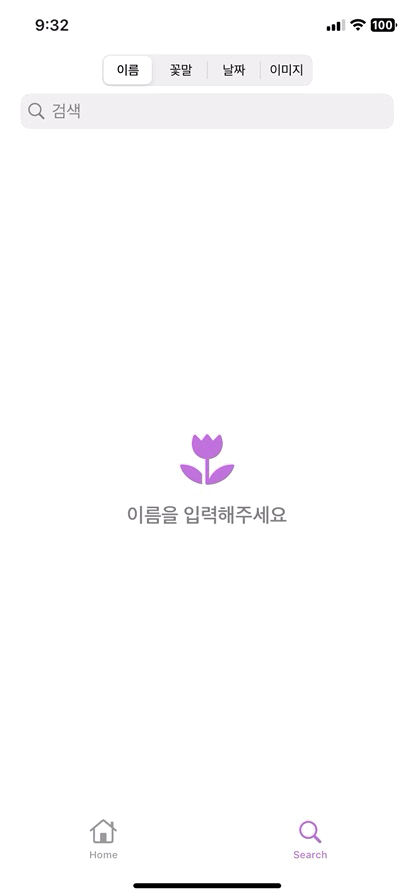

# Today's Flowers (오늘의 꽃)
앱스쿨 두번째 단기 프로젝트, 오늘의 꽃 시작합니다.

## Stacks 👨‍💻
### Architecture

    

기존의 MVVM에서 Clean Architecture 개념 일부분을 빌려와서 작성한 아키텍처 패턴 입니다. 각 화면들은 각자의 view model을 가지고 각 view model은
화면들의 use case를 가지고 있습니다. 가령, Home View의 use case는 첫 앱이 구동되고, 서버(혹은 로컬)에서 꽃 객체들을 가져와서 보여주는 것 입니다.
또 Detail View는 특정 id를 통해 꽃 객체의 상세 정보를 보여주는 것이 use case 입니다. 모든 로직이 분리되어 있기에, 손쉬운 확장을 기대할 수 있습니다.

### Core

    

MVVM의 View와 ViewModel의 바인드와 각 의존성들 사이의 비동기 처리를 위해 Combine을 사용합니다. 

    

이미지 검색, 이미지 Lifting, 그리고 이미지 필터를 위해 Vision을 사용합니다.

## Features 🎱

<table width="100%">
    <tr>
      <td width="25%"  align="center"></td>
      <td width="25%"  align="center"></td>
      <td width="25%"  align="center"></td>
      <td width="25%"  align="center"></td>
    </tr>
</table>

## Futrue Directions 🗒️
- [x] 검색확장
- 화면 인터랙션
    - [x] 화면 전환 애니메이션
- CoreML 사용
    - [x] VisionKit
    - [x] Vision

## Team 👥
|5.김진웅|5.안성근|5.이인호|5.황민경|
|:-:|:-:|:-:|:-:|
|||||
|INTJ [@jinwoong](https://github.com/jinwoong16)|INTP [@mo-si-dev](https://github.com/mo-si-dev)|INFJ [@womyo](https://github.com/womyo)|INFP [@mghhwang](https://github.com/mghhwang)|

